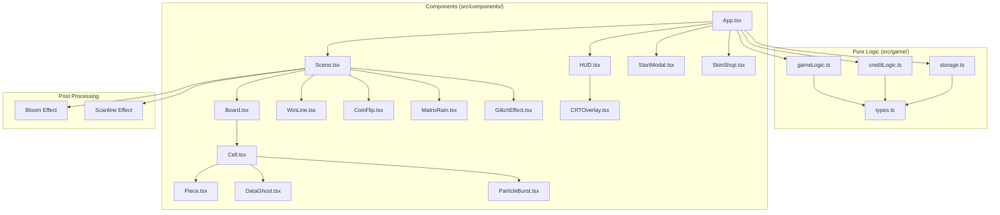

# Design Document: XOXO — Cyberpunk 3D Tic-Tac-Toe

## Overview

XOXO is a cyberpunk-themed 3D tic-tac-toe game built with React Three Fiber. Two local players enter their names, choose marks, and compete on a neon-lit 3D board with visual effects including bloom, particle bursts, data ghosts, glitch-win animations, and a CRT scanline overlay. The game features an optional Overclock Mode (timed turns), a credit/skin progression system, and a localStorage-persisted leaderboard.

The architecture separates pure game logic (`src/game/`) from visual/interactive code (`src/components/`). All game state mutations happen through pure functions; React components consume state and render the 3D scene and HUD overlay.

## Architecture



### Layer Responsibilities

| Layer | Responsibility | Imports Allowed |
|-------|---------------|-----------------|
| `src/game/types.ts` | Type definitions shared across the app | None (pure TS) |
| `src/game/gameLogic.ts` | Board state, move validation, win/draw detection, overclock random move | `types.ts` only |
| `src/game/creditLogic.ts` | Credit awarding, skin purchasing, balance management | `types.ts` only |
| `src/game/storage.ts` | JSON serialization/deserialization, localStorage read/write | `types.ts` only |
| `src/components/*` | All React/R3F visual and interactive code | May import from `src/game/` |
| `App.tsx` | Composition root — wires state to Scene + HUD | All game logic + components |

## Components and Interfaces

### Pure Game Logic API (`src/game/gameLogic.ts`)

```typescript
// Creates a fresh empty board
function createBoard(): BoardState;

// Places a mark at the given index, returns new board state or null if invalid
function placeMark(board: BoardState, index: CellIndex, mark: Mark): BoardState | null;

// Checks if a cell is empty
function isCellEmpty(board: BoardState, index: CellIndex): boolean;

// Detects win condition — returns winning line indices or null
function checkWin(board: BoardState): WinResult | null;

// Detects draw — all cells filled with no winner
function checkDraw(board: BoardState): boolean;

// Returns the game status after a move
function getGameStatus(board: BoardState): GameStatus;

// Picks a random empty cell (for Overclock timeout)
function getRandomEmptyCell(board: BoardState): CellIndex | null;

// Toggles the current player
function nextPlayer(current: Mark): Mark;
```

### Credit Logic API (`src/game/creditLogic.ts`)

```typescript
// Awards credits to the winning player
function awardCredits(player: PlayerData, amount: number): PlayerData;

// Attempts to purchase a skin, returns updated player or null if insufficient credits
function purchaseSkin(player: PlayerData, skin: Skin): PlayerData | null;

// Checks if a player can afford a skin
function canAffordSkin(player: PlayerData, skin: Skin): boolean;

// Returns the list of available skins with prices
function getAvailableSkins(): Skin[];
```

### Storage API (`src/game/storage.ts`)

```typescript
// Serializes game state to JSON string
function serializeGameState(state: PersistentState): string;

// Deserializes JSON string to game state, returns null if invalid
function deserializeGameState(json: string): PersistentState | null;

// Saves state to localStorage
function saveState(state: PersistentState): void;

// Loads state from localStorage, returns default if missing/corrupt
function loadState(): PersistentState;
```

### React Component Tree

| Component | Props | Responsibility |
|-----------|-------|---------------|
| `App` | — | Root. Manages game state via `useReducer`. Composes Scene + HUD. |
| `Scene` | `gameState, onCellClick` | R3F Canvas wrapper. Contains Board, lighting, camera, postprocessing, MatrixRain. |
| `Board` | `board, onCellClick, winResult, gamePhase` | Renders 3x3 grid of Cells. Renders grid lines with neon glow. |
| `Cell` | `index, mark, onClick, isWinning, skin` | Clickable 3D cell. Renders Piece if occupied. Triggers ParticleBurst on placement. |
| `Piece` | `mark, skin, isCorrupted, animationPhase` | 3D X or O mesh with drop animation. Applies skin color. Glitch shader if corrupted. |
| `WinLine` | `startIndex, endIndex` | Animated neon line through winning cells. |
| `DataGhost` | `mark, position, skin` | Fading translucent copy of previous move's piece. |
| `ParticleBurst` | `position, color` | Burst of neon particles on piece placement. |
| `MatrixRain` | — | Background falling character effect. |
| `GlitchEffect` | `active, intensity` | Board shake + dissolve effect on win. |
| `CoinFlip` | `onComplete, playerNames` | 3D coin flip animation to determine starting player. |
| `HUD` | `gameState, onReset, onStartGame, onOpenShop` | 2D overlay: turn indicator, timer, credits, leaderboard, buttons. |
| `StartModal` | `onStart` | Modal for player name entry, mark selection, overclock toggle. |
| `SkinShop` | `players, onPurchase, onClose` | Modal for browsing and purchasing skins with credits. |
| `CRTOverlay` | — | CSS-based scanline overlay across the viewport. |

### Post-Processing Pipeline

The Scene uses `@react-three/postprocessing` for:
- **Bloom**: `<Bloom luminanceThreshold={0.2} intensity={1.5} />` — makes emissive neon materials glow
- **Scanline**: `<Scanline density={1.25} />` — subtle CRT scanline effect in the 3D viewport

The CRT overlay is a separate CSS layer on top of the canvas for the full-viewport scanline feel, since postprocessing Scanline only affects the 3D scene.

## Data Models

### Core Types (`src/game/types.ts`)

```typescript
type Mark = 'X' | 'O';
type CellValue = Mark | null;
type BoardState = readonly [
  CellValue, CellValue, CellValue,
  CellValue, CellValue, CellValue,
  CellValue, CellValue, CellValue
];
type CellIndex = 0 | 1 | 2 | 3 | 4 | 5 | 6 | 7 | 8;

interface WinResult {
  readonly winner: Mark;
  readonly line: readonly [CellIndex, CellIndex, CellIndex];
}

type GamePhase = 'setup' | 'coin-flip' | 'playing' | 'won' | 'draw';

interface GameStatus {
  readonly phase: GamePhase;
  readonly winResult: WinResult | null;
}

interface PlayerData {
  readonly name: string;
  readonly mark: Mark;
  readonly credits: number;
  readonly wins: number;
  readonly activeSkin: SkinId;
  readonly unlockedSkins: readonly SkinId[];
}

type SkinId = 'default' | 'acid-green' | 'synthwave-pink' | 'hazard-orange';

interface Skin {
  readonly id: SkinId;
  readonly name: string;
  readonly color: string; // hex color
  readonly price: number; // in credits, 0 for default
}

interface GameState {
  readonly board: BoardState;
  readonly currentPlayer: Mark;
  readonly phase: GamePhase;
  readonly winResult: WinResult | null;
  readonly players: readonly [PlayerData, PlayerData];
  readonly overclockEnabled: boolean;
  readonly turnTimeRemaining: number | null; // seconds, null if overclock disabled
  readonly lastMove: CellIndex | null; // for data ghost
  readonly moveCount: number; // for progressive corruption intensity
}

interface LeaderboardEntry {
  readonly name: string;
  readonly credits: number;
  readonly wins: number;
}

interface PersistentState {
  readonly leaderboard: readonly LeaderboardEntry[];
  readonly playerSkins: Record<string, { activeSkin: SkinId; unlockedSkins: readonly SkinId[] }>;
}
```

### Win Detection Constants

The 8 winning lines for a 3x3 board, stored as a constant array:

```typescript
const WIN_LINES: readonly (readonly [CellIndex, CellIndex, CellIndex])[] = [
  [0, 1, 2], // top row
  [3, 4, 5], // middle row
  [6, 7, 8], // bottom row
  [0, 3, 6], // left column
  [1, 4, 7], // middle column
  [2, 5, 8], // right column
  [0, 4, 8], // main diagonal
  [2, 4, 6], // anti-diagonal
];
```

`checkWin` iterates over `WIN_LINES` and checks if all three cells in any line contain the same non-null mark.

### State Reducer

`App.tsx` uses `useReducer` with a `GameAction` discriminated union:

```typescript
type GameAction =
  | { type: 'PLACE_MARK'; index: CellIndex }
  | { type: 'RESET_GAME' }
  | { type: 'START_GAME'; players: [PlayerData, PlayerData]; overclockEnabled: boolean }
  | { type: 'COIN_FLIP_COMPLETE'; startingMark: Mark }
  | { type: 'OVERCLOCK_TIMEOUT' }
  | { type: 'TICK_TIMER' }
  | { type: 'PURCHASE_SKIN'; playerMark: Mark; skinId: SkinId };
```

The reducer delegates to pure functions in `gameLogic.ts` and `creditLogic.ts`, keeping the reducer itself thin.

### localStorage Schema

Key: `xoxo-game-state`

```json
{
  "leaderboard": [
    { "name": "Player1", "credits": 150, "wins": 3 }
  ],
  "playerSkins": {
    "Player1": {
      "activeSkin": "acid-green",
      "unlockedSkins": ["default", "acid-green"]
    }
  }
}
```

### 3D Grid Layout

The board is centered at origin `(0, 0, 0)`. Each cell is 1 unit wide with 0.1 unit gaps:

```
Cell positions (x, z) — y is the vertical axis for drop animation:
(-1.1, -1.1) | (0, -1.1) | (1.1, -1.1)
(-1.1,  0)   | (0,  0)   | (1.1,  0)
(-1.1,  1.1) | (0,  1.1) | (1.1,  1.1)
```

Grid lines are rendered as thin `BoxGeometry` meshes with emissive neon material. Pieces drop from `y = 3` to `y = 0.5` using a spring animation (via `@react-three/drei`'s `useSpring` or a simple `useFrame` lerp).

### Overclock Timer

When Overclock Mode is enabled, each turn starts a 10-second countdown. The timer is managed in the reducer via `TICK_TIMER` actions dispatched from a `useEffect` interval in `App.tsx`. When it hits 0, `OVERCLOCK_TIMEOUT` is dispatched, which calls `getRandomEmptyCell` and places a corrupted mark.

### Skin System

Default skins are free. Additional skins cost credits:

| Skin | Color | Price |
|------|-------|-------|
| Default | `#00ffff` (cyan) | 0 |
| Acid Green | `#39ff14` | 50 |
| Synthwave Pink | `#ff00ff` | 50 |
| Hazard Orange | `#ff6600` | 75 |

Credits awarded per win: 25.


## Correctness Properties

*A property is a characteristic or behavior that should hold true across all valid executions of a system — essentially, a formal statement about what the system should do. Properties serve as the bridge between human-readable specifications and machine-verifiable correctness guarantees.*

The following properties were derived from the acceptance criteria prework analysis. Requirements 3.1–3.3 (horizontal, vertical, diagonal win detection) were consolidated into a single property since the `WIN_LINES` constant covers all 8 lines uniformly. Requirements 5.2 and 5.4 were combined into a single reset property. Requirements 8.1 and 8.2 were combined into a single leaderboard sorting property.

### Property 1: Name validation prevents empty names

*For any* combination of two player name inputs where at least one name is empty or whitespace-only, the game setup validation SHALL reject the configuration and prevent game start.

**Validates: Requirements 1.4**

### Property 2: Valid moves on empty cells succeed

*For any* board state and *any* cell index that is currently empty, calling `placeMark` with that index SHALL return a new board state where that cell contains the placed mark and all other cells remain unchanged.

**Validates: Requirements 2.1**

### Property 3: Turn alternation after placement

*For any* board state and *any* valid move, after placing a mark the current player SHALL switch to the other player. Specifically, `nextPlayer(current)` always returns the opposite mark.

**Validates: Requirements 2.3**

### Property 4: Occupied cell rejection

*For any* board state with at least one occupied cell, calling `placeMark` on an occupied cell SHALL return null and the board state SHALL remain unchanged.

**Validates: Requirements 2.4**

### Property 5: Terminal state rejection

*For any* board state where `getGameStatus` returns a phase of `'won'` or `'draw'`, calling `placeMark` on any cell (empty or occupied) SHALL return null.

**Validates: Requirements 2.5**

### Property 6: Win detection across all winning lines

*For any* board state where three cells along any of the 8 winning lines (3 rows, 3 columns, 2 diagonals) contain the same non-null mark, `checkWin` SHALL return a `WinResult` identifying that mark as the winner and the corresponding line indices.

**Validates: Requirements 3.1, 3.2, 3.3**

### Property 7: Draw detection on full board

*For any* board state where all nine cells are filled and no winning line exists, `checkDraw` SHALL return true.

**Validates: Requirements 3.4**

### Property 8: Reset clears board and preserves player identity

*For any* game state with any combination of placed marks and player configurations, resetting the game SHALL produce an empty board (all cells null) while preserving both player names and mark assignments.

**Validates: Requirements 5.2, 5.4**

### Property 9: Overclock timeout places mark in empty cell

*For any* board state with at least one empty cell, `getRandomEmptyCell` SHALL return an index that corresponds to an empty cell on the board.

**Validates: Requirements 6.3**

### Property 10: Credit awarding increases balance

*For any* player with *any* credit balance (including zero), calling `awardCredits` with a positive amount SHALL return a player whose credit balance equals the original balance plus the award amount, and whose other fields remain unchanged.

**Validates: Requirements 7.1**

### Property 11: Skin purchase deducts credits and unlocks skin

*For any* player with sufficient credits and *any* available skin not yet unlocked, calling `purchaseSkin` SHALL return a player whose credit balance is reduced by the skin's price, whose `unlockedSkins` includes the new skin, and whose `activeSkin` is set to the purchased skin. For any player with insufficient credits, `purchaseSkin` SHALL return null.

**Validates: Requirements 7.4**

### Property 12: Leaderboard maintains descending credit order after updates

*For any* leaderboard state and *any* credit award to any player, after updating the leaderboard entry and re-sorting, the resulting leaderboard SHALL be sorted in descending order by total credits.

**Validates: Requirements 8.1, 8.2**

### Property 13: Serialization round-trip

*For any* valid `PersistentState` object, `deserializeGameState(serializeGameState(state))` SHALL produce an object equivalent to the original state.

**Validates: Requirements 12.4**

### Property 14: Corrupted data produces default state

*For any* string that is not valid JSON or does not conform to the `PersistentState` schema, `deserializeGameState` SHALL return null, and `loadState` SHALL return a fresh default state.

**Validates: Requirements 12.5**

## Error Handling

| Error Scenario | Handling Strategy | Requirement |
|---|---|---|
| Empty player name on game start | Validation in StartModal prevents submission; HUD shows inline error | 1.4 |
| Click on occupied cell | `placeMark` returns null; UI ignores click silently | 2.4 |
| Click after game over | `getGameStatus` check in reducer prevents `PLACE_MARK` action | 2.5 |
| Overclock timer expires | Reducer handles `OVERCLOCK_TIMEOUT` by calling `getRandomEmptyCell` | 6.3 |
| Insufficient credits for skin | `purchaseSkin` returns null; SkinShop disables purchase button | 7.4 |
| Corrupted localStorage data | `deserializeGameState` returns null; `loadState` falls back to default | 12.5 |
| localStorage unavailable | `saveState` wraps in try/catch; game continues without persistence | 12.5 |
| All cells filled during overclock | `getRandomEmptyCell` returns null; should not happen as game ends on draw | 6.3, 3.4 |

## Testing Strategy

### Dual Testing Approach

This project uses both unit tests and property-based tests for comprehensive coverage:

- **Unit tests** (Vitest): Verify specific examples, edge cases, integration points, and UI behavior
- **Property-based tests** (Vitest + `fast-check`): Verify universal properties across randomly generated inputs

### Property-Based Testing Configuration

- Library: [`fast-check`](https://github.com/dubzzz/fast-check) — the standard PBT library for TypeScript
- Framework: Vitest (already in tech stack)
- Minimum iterations: 100 per property test
- Each property test MUST reference its design document property with a tag comment:
  ```typescript
  // Feature: cyberpunk-tic-tac-toe, Property 6: Win detection across all winning lines
  ```
- Each correctness property MUST be implemented by a SINGLE property-based test

### Test Organization

```
src/
├── game/
│   ├── __tests__/
│   │   ├── gameLogic.test.ts      # Unit tests for game logic
│   │   ├── gameLogic.prop.test.ts # Property tests for game logic (Properties 2-9)
│   │   ├── creditLogic.test.ts    # Unit tests for credit/skin logic
│   │   ├── creditLogic.prop.test.ts # Property tests for credits/skins (Properties 10-12)
│   │   ├── storage.test.ts        # Unit tests for serialization
│   │   └── storage.prop.test.ts   # Property tests for serialization (Properties 13-14)
```

### Unit Test Coverage (Required)

Unit and regression tests are mandatory for all logic modules. Unit tests focus on:
- Specific board configurations (known wins, known draws)
- Edge cases: first move, last move, full board
- Error conditions: invalid inputs, corrupted data
- Integration: reducer dispatches correct actions
- UI examples: modal opens, buttons enable/disable (where applicable)

All test tasks are required — none are optional.

### Property Test Coverage

Each property from the Correctness Properties section maps to one `fast-check` test:

| Property | Test File | Generator Strategy |
|---|---|---|
| P1: Name validation | `gameLogic.prop.test.ts` | Generate pairs of strings including empty/whitespace |
| P2: Valid move placement | `gameLogic.prop.test.ts` | Generate partial boards + random empty cell index |
| P3: Turn alternation | `gameLogic.prop.test.ts` | Generate marks, verify `nextPlayer` toggles |
| P4: Occupied cell rejection | `gameLogic.prop.test.ts` | Generate boards with occupied cells, pick occupied index |
| P5: Terminal state rejection | `gameLogic.prop.test.ts` | Generate won/drawn boards, attempt any move |
| P6: Win detection | `gameLogic.prop.test.ts` | Generate boards with a forced winning line |
| P7: Draw detection | `gameLogic.prop.test.ts` | Generate full boards with no winning line |
| P8: Reset preserves identity | `gameLogic.prop.test.ts` | Generate game states, apply reset |
| P9: Overclock random cell | `gameLogic.prop.test.ts` | Generate partial boards, call `getRandomEmptyCell` |
| P10: Credit awarding | `creditLogic.prop.test.ts` | Generate players with random balances + award amounts |
| P11: Skin purchase | `creditLogic.prop.test.ts` | Generate players with random balances + random skins |
| P12: Leaderboard sorting | `creditLogic.prop.test.ts` | Generate leaderboard entries, apply random updates |
| P13: Serialization round-trip | `storage.prop.test.ts` | Generate valid `PersistentState` objects |
| P14: Corrupted data handling | `storage.prop.test.ts` | Generate arbitrary strings / malformed JSON |
