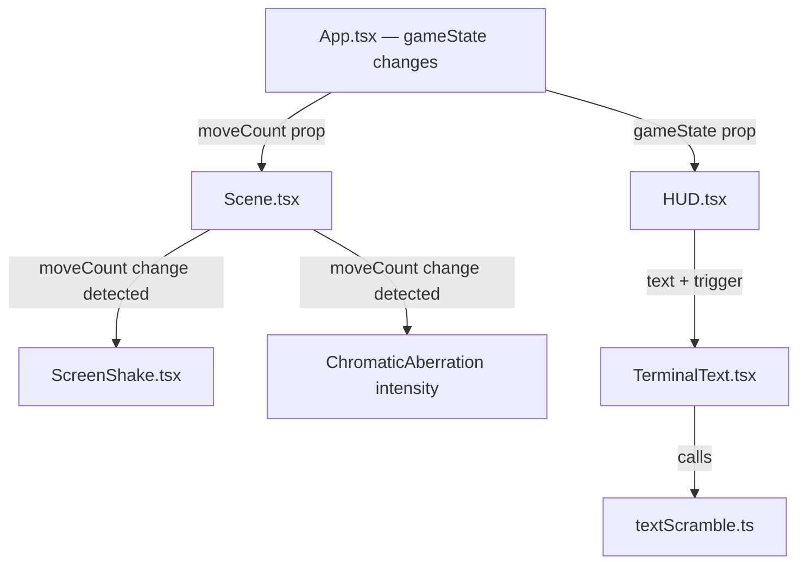

# Design Document: Feedback Loop & Terminal UI

## Overview

This design adds two visual feature sets to the existing XOXO cyberpunk tic-tac-toe game:

1. **Feedback Loop** — Screen shake + chromatic aberration triggered on every piece placement, adding tactile impact to moves.
2. **The Jack-In (Terminal UI)** — Typewriter and hex-scramble text animations for the turn indicator and game-end messages, making the HUD feel like a hacking terminal.

Both features are purely visual/presentational. They do not alter game logic, state management, or data persistence. They integrate into the existing R3F post-processing pipeline and HUD overlay.

## Architecture

The features slot into the existing architecture without structural changes:

```
src/
├── components/
│   ├── Scene.tsx          # Modified — adds ChromaticAberration effect + shake trigger
│   ├── ScreenShake.tsx    # NEW — R3F component that shakes camera on trigger
│   ├── HUD.tsx            # Modified — uses TerminalText for turn indicator + end messages
│   └── TerminalText.tsx   # NEW — React component implementing typewriter + hex scramble
├── game/
│   └── textScramble.ts    # NEW — Pure logic for hex scramble character generation
```

### Data Flow



When `PLACE_MARK` is dispatched:
1. `gameState.moveCount` increments
2. `Scene.tsx` detects the change and triggers `ScreenShake` + ramps up `ChromaticAberration` intensity
3. `HUD.tsx` detects `currentPlayer` change and passes new text to `TerminalText`
4. `TerminalText` runs hex scramble → typewriter sequence

## Components and Interfaces

### ScreenShake Component

A React Three Fiber component that imperatively shakes the camera when triggered.

```typescript
interface ScreenShakeProps {
  trigger: number;        // Incrementing value — shake fires on change
  intensity?: number;     // Max displacement in world units (default: 0.15)
  duration?: number;      // Shake duration in ms (default: 200)
}
```

**Implementation approach:**
- Uses `useThree()` to access the camera
- Uses `useFrame()` to apply random offsets each frame during the shake window
- Stores the camera's original position on trigger, applies random offsets within `[-intensity, +intensity]` on x/y, and lerps back to original over `duration`
- Uses a `useRef` to track shake state (start time, original position) without re-renders
- On trigger change (detected via `useEffect`), starts the shake. `useFrame` handles the per-frame displacement and decay.

### ChromaticAberration Integration

Uses the existing `@react-three/postprocessing` `ChromaticAberration` effect from the `postprocessing` library.

```typescript
// Inside Scene.tsx EffectComposer
<ChromaticAberration
  offset={chromaticOffset}  // Vector2 — animated from peak to [0,0]
  radialModulation={false}
  modulationOffset={0}
/>
```

**Implementation approach:**
- Add a `chromaticOffset` state (a `THREE.Vector2`) in `Scene.tsx`
- On `moveCount` change, set offset to peak value (e.g., `[0.008, 0.008]`)
- Use `useFrame` to decay the offset back to `[0, 0]` over ~300ms
- The `ChromaticAberration` effect is added to the existing `EffectComposer` alongside `Bloom` and `Scanline`

### TerminalText Component

A React component that animates text changes with hex scramble followed by typewriter reveal.

```typescript
interface TerminalTextProps {
  text: string;                    // Target text to display
  scrambleDuration?: number;       // Hex scramble phase duration in ms (default: 400)
  typewriterSpeed?: number;        // Ms per character for typewriter phase (default: 50)
  className?: string;              // Optional CSS class
  style?: React.CSSProperties;    // Optional inline styles
}
```

**Animation phases:**
1. **Scramble phase**: All character positions cycle through random hex chars. Characters resolve left-to-right over `scrambleDuration`.
2. **Typewriter phase**: Resolved text is revealed character by character at `typewriterSpeed` rate with a blinking cursor `▌` appended.
3. **Complete**: Full text displayed, cursor removed.

**Implementation approach:**
- Uses `useState` for displayed text and animation phase
- Uses `useEffect` + `setInterval` to drive the animation frames
- Calls pure functions from `textScramble.ts` for character generation
- Cleans up intervals on unmount or when `text` prop changes (interruption)

### textScramble Module

Pure utility functions for hex scramble logic. Lives in `src/game/` since it has no React/Three.js dependencies.

```typescript
// Characters used during scramble
const HEX_CHARS = '0123456789ABCDEF._';

/** Generate a single random hex/cyber character */
export const randomHexChar = (): string;

/** 
 * Generate a scrambled string where characters up to `resolvedCount` 
 * show their final value and the rest are random hex chars.
 */
export const scrambleText = (
  target: string,
  resolvedCount: number
): string;

/**
 * Generate the typewriter-revealed portion of text with cursor.
 */
export const typewriterText = (
  target: string,
  revealedCount: number
): string;
```

### Modified Scene.tsx

Changes to the existing `Scene` component:

```typescript
interface SceneProps {
  // ... existing props
  moveCount: number;  // NEW — passed from App.tsx to trigger feedback effects
}
```

- Adds `moveCount` prop
- Adds `ScreenShake` component triggered by `moveCount`
- Adds `ChromaticAberration` to `SceneEffects` with animated offset
- Uses `useEffect` on `moveCount` to trigger the chromatic aberration ramp

### Modified HUD.tsx

Changes to the existing `HUD` component:

- Replaces static turn indicator text with `<TerminalText>` component
- Replaces static end-game message text with `<TerminalText>`
- On game reset, passes empty/default text which triggers `TerminalText` to cancel and reset

## Data Models

No new data models are required. These features are purely visual and do not modify `GameState`, `GameAction`, or any persisted data structures.

The only data flow change is passing `moveCount` from `App.tsx` through to `Scene.tsx` as a prop, which already exists on `GameState`.

### State for Visual Effects (Component-Local)

```typescript
// ScreenShake internal ref state
interface ShakeState {
  active: boolean;
  startTime: number;
  originalPosition: { x: number; y: number; z: number };
}

// TerminalText internal state
interface TerminalAnimationState {
  phase: 'scramble' | 'typewriter' | 'complete';
  resolvedCount: number;    // Characters resolved so far (scramble phase)
  revealedCount: number;    // Characters revealed so far (typewriter phase)
  displayText: string;      // Current text being shown
}
```

These are component-local states, not part of the global game state.


## Correctness Properties

*A property is a characteristic or behavior that should hold true across all valid executions of a system — essentially, a formal statement about what the system should do. Properties serve as the bridge between human-readable specifications and machine-verifiable correctness guarantees.*

Most of this feature is visual/animation work (screen shake, chromatic aberration, React animation lifecycle) which cannot be meaningfully validated through pure-function property testing. However, the `textScramble.ts` module contains pure functions with clear invariants that are well-suited to property-based testing.

### Property 1: Scramble resolved prefix matches target

*For any* target string and any valid `resolvedCount` (0 ≤ resolvedCount ≤ target.length), the first `resolvedCount` characters of `scrambleText(target, resolvedCount)` should exactly match the first `resolvedCount` characters of `target`.

**Validates: Requirements 4.1, 4.2**

**Reasoning:** Requirements 4.1 and 4.2 both specify that during hex scramble, characters resolve left-to-right to their final values. This property verifies that the resolved prefix is always correct regardless of target string content or length.

### Property 2: Scramble unresolved suffix uses only hex characters

*For any* target string and any valid `resolvedCount` (0 ≤ resolvedCount < target.length), every character in `scrambleText(target, resolvedCount)` at positions beyond `resolvedCount` should be a member of the allowed hex character set (`0-9`, `A-F`, `.`, `_`).

**Validates: Requirements 4.4**

**Reasoning:** Requirement 4.4 specifies that scrambled characters must be uppercase hex characters and cyberpunk symbols. This property ensures no invalid characters leak into the scramble output, for all possible target strings.

### Property 3: Typewriter reveal shows correct prefix with cursor behavior

*For any* target string and any valid `revealedCount` (0 ≤ revealedCount ≤ target.length):
- When `revealedCount < target.length`, `typewriterText(target, revealedCount)` should equal the first `revealedCount` characters of `target` followed by a cursor character `▌`
- When `revealedCount === target.length`, `typewriterText(target, revealedCount)` should equal `target` with no cursor appended

**Validates: Requirements 3.1, 3.2**

**Reasoning:** Requirements 3.1 and 3.2 specify sequential left-to-right character reveal with a blinking cursor during animation. Requirement 3.3 (edge case) specifies cursor removal on completion. This single property covers all three by testing the full range of revealedCount values.

## Error Handling

### Screen Shake

- If the camera reference is unavailable (e.g., component mounts before canvas is ready), the shake should silently no-op rather than throwing.
- If `duration` or `intensity` props are zero or negative, treat as no-shake (early return).

### Chromatic Aberration

- If the `ChromaticAberration` effect fails to initialize (e.g., WebGL limitation), the game should continue without the effect. The effect is purely cosmetic.
- The offset vector should be clamped to prevent extreme values that could make the game unplayable.

### Terminal Text

- If `text` prop is an empty string, `TerminalText` should render nothing without running animations.
- If `scrambleDuration` or `typewriterSpeed` are zero or negative, skip the respective animation phase and display the final text immediately.
- On unmount, all `setInterval`/`setTimeout` handles must be cleared to prevent memory leaks and state updates on unmounted components.

## Testing Strategy

### Unit Tests

Unit tests cover specific examples and edge cases for the pure `textScramble.ts` functions:

- `scrambleText` with empty string returns empty string
- `scrambleText` with `resolvedCount === target.length` returns the target exactly
- `typewriterText` with `revealedCount === 0` returns just the cursor
- `typewriterText` with empty target returns empty string (no cursor)
- `randomHexChar` returns a single character

### Property-Based Tests

Property tests use `fast-check` (already in devDependencies) to validate universal invariants across randomized inputs. Each property test runs a minimum of 100 iterations.

- **Feature: feedback-and-terminal-ui, Property 1: Scramble resolved prefix matches target** — Generate random strings and random resolvedCount values, verify prefix match.
- **Feature: feedback-and-terminal-ui, Property 2: Scramble unresolved suffix uses only hex characters** — Generate random strings and partial resolvedCount values, verify all unresolved characters are in the hex set.
- **Feature: feedback-and-terminal-ui, Property 3: Typewriter reveal shows correct prefix with cursor behavior** — Generate random strings and revealedCount values, verify prefix + cursor logic.

### Testing Library

- **Property-based testing**: `fast-check` v4.5.3 (already installed)
- **Test runner**: Vitest (already configured)
- **Test location**: `src/game/__tests__/textScramble.prop.test.ts` for property tests, `src/game/__tests__/textScramble.test.ts` for unit tests

### What Is NOT Tested

The following are visual/animation concerns tested manually or via visual regression:
- Screen shake camera displacement and decay
- Chromatic aberration intensity ramp and decay
- TerminalText React component animation lifecycle (phase transitions, interruption, cleanup)
- CSS styling preservation during animations
