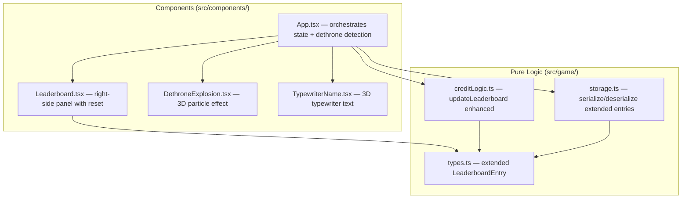

# Design Document: Leaderboard Enhancement

## Overview

Enhance the existing leaderboard system in the cyberpunk 3D tic-tac-toe game. The current leaderboard tracks only name, credits, and wins. This enhancement expands it to track comprehensive statistics (wins, losses, draws, win streaks), repositions it as a fixed right-side panel, adds a reset button, and introduces two 3D animations: a particle explosion when the #1 leader is dethroned, and a typewriter effect when a new leader claims the top spot.

The design follows the existing architecture: pure game logic in `src/game/` (no React/Three.js imports), visual components in `src/components/`. The leaderboard data model is extended in `types.ts`, update logic lives in `creditLogic.ts`, persistence uses the existing `storage.ts` pattern, and new components handle the animations.

## Architecture



### Changes by Layer

| Layer | Change | Rationale |
|-------|--------|-----------|
| `src/game/types.ts` | Extend `LeaderboardEntry` with losses, draws, currentStreak, bestStreak | Requirement 2.1 |
| `src/game/creditLogic.ts` | Enhance `updateLeaderboard` to handle wins/losses/draws/streaks; add `resetLeaderboard`; add `detectDethrone` | Requirements 2.2–2.6, 5.2, 6.1–6.2, 7.1, 9.1–9.2 |
| `src/game/storage.ts` | Update deserialization validation for new fields; migrate old entries | Requirement 4.1–4.4 |
| `src/components/Leaderboard.tsx` | Rewrite as fixed right-side panel; show all stats; add reset button | Requirements 1.1–1.2, 2.7, 5.1 |
| `src/components/DethroneExplosion.tsx` | New R3F component: particle explosion at screen-space position | Requirement 7.1–7.2 |
| `src/components/TypewriterName.tsx` | New R3F component: typewriter text animation | Requirement 8.1–8.2 |
| `src/App.tsx` | Track previous #1 leader; detect dethrone; trigger animations; handle draw updates; wire reset | Requirements 6.1–6.3, 7.1, 8.1 |

## Components and Interfaces

### Pure Logic API Changes

#### `src/game/creditLogic.ts`

```typescript
// Enhanced: updates wins/losses/draws/streaks for BOTH players after a game
function updateLeaderboardAfterWin(
  leaderboard: readonly LeaderboardEntry[],
  winnerName: string,
  loserName: string,
  creditsEarned: number,
): LeaderboardEntry[];

// New: updates draws and streaks for both players after a draw
function updateLeaderboardAfterDraw(
  leaderboard: readonly LeaderboardEntry[],
  player1Name: string,
  player2Name: string,
): LeaderboardEntry[];

// New: clears all leaderboard entries
function resetLeaderboard(): LeaderboardEntry[];

// New: detects if the #1 leader changed
function detectDethrone(
  previousLeader: string | null,
  newLeaderboard: readonly LeaderboardEntry[],
): { dethroned: boolean; oldLeader: string | null; newLeader: string | null };

// Existing: sort by credits desc, then wins desc as tiebreaker
function sortLeaderboard(leaderboard: LeaderboardEntry[]): LeaderboardEntry[];
```

#### `src/game/storage.ts`

The existing `deserializeGameState` will be updated to validate the new `LeaderboardEntry` fields. Old entries missing the new fields will be migrated by defaulting `losses`, `draws`, `currentStreak`, and `bestStreak` to 0.

### Component Interfaces

#### `Leaderboard.tsx` (Rewritten)

```typescript
interface LeaderboardProps {
  leaderboard: readonly LeaderboardEntry[];
  onReset: () => void;
  newLeader: string | null;       // triggers typewriter effect
  dethronedLeader: string | null; // triggers explosion visual cue
}
```

- Fixed position on the right side of the viewport
- Displays: rank, name, wins, losses, draws, best streak, credits
- Reset button at the bottom
- Cyberpunk styling consistent with existing HUD

#### `DethroneExplosion.tsx` (New — R3F Component)

```typescript
interface DethroneExplosionProps {
  active: boolean;
  position: [number, number, number];
  onComplete: () => void;
}
```

- 3D particle burst effect (similar pattern to existing `ParticleBurst.tsx`)
- Larger particle count and longer duration for dramatic effect
- Magenta/cyan color scheme matching the cyberpunk theme
- Triggers `onComplete` callback when animation finishes

#### `TypewriterName.tsx` (New — R3F Component)

```typescript
interface TypewriterNameProps {
  name: string;
  active: boolean;
  onComplete: () => void;
}
```

- Uses `@react-three/drei` `Text` component
- Reveals characters one at a time with a cursor blink
- Cyberpunk monospace font styling
- Triggers `onComplete` when full name is displayed

### App.tsx Orchestration

The `App` component will:
1. Track the previous #1 leader name in a `useRef`
2. After each leaderboard update, call `detectDethrone` to compare old vs new #1
3. If dethroned, set state to trigger `DethroneExplosion` and `TypewriterName`
4. Handle draw game endings by calling `updateLeaderboardAfterDraw`
5. Wire the reset button callback to `resetLeaderboard` + `saveState`

## Data Models

### Extended `LeaderboardEntry`

```typescript
interface LeaderboardEntry {
  readonly name: string;
  readonly credits: number;
  readonly wins: number;
  readonly losses: number;
  readonly draws: number;
  readonly currentStreak: number;
  readonly bestStreak: number;
}
```

### Sorting Rules

1. Primary: `credits` descending
2. Tiebreaker: `wins` descending

### Streak Logic

- Win: `currentStreak += 1`, `bestStreak = max(bestStreak, currentStreak)`
- Loss or Draw: `currentStreak = 0`

### Migration Strategy

Old `LeaderboardEntry` objects (with only `name`, `credits`, `wins`) will be migrated during deserialization by defaulting missing fields to `0`. This is handled in `deserializeGameState`.

### localStorage Schema (Updated)

```json
{
  "leaderboard": [
    {
      "name": "Player1",
      "credits": 150,
      "wins": 3,
      "losses": 1,
      "draws": 0,
      "currentStreak": 2,
      "bestStreak": 3
    }
  ],
  "playerSkins": { ... }
}
```

## Correctness Properties

*A property is a characteristic or behavior that should hold true across all valid executions of a system — essentially, a formal statement about what the system should do. Properties serve as the bridge between human-readable specifications and machine-verifiable correctness guarantees.*

The following properties were derived from the acceptance criteria prework analysis. Several related criteria were consolidated to eliminate redundancy:
- Requirements 2.2, 2.4, 2.6 → Property 1 (win update correctness)
- Requirements 2.3, 2.5, 2.6 → Property 2 (draw update correctness)
- Requirements 3.2, 3.3 → Property 3 (entry uniqueness)
- Requirements 6.1, 6.2, 9.1, 9.2 → Property 4 (sorting invariant)

### Property 1: Win update correctness

*For any* leaderboard state and *any* two distinct player names (winner and loser), after calling `updateLeaderboardAfterWin`, the winner's entry SHALL have wins incremented by 1, currentStreak incremented by 1, bestStreak equal to the maximum of the previous bestStreak and the new currentStreak, and credits increased by the award amount. The loser's entry SHALL have losses incremented by 1 and currentStreak reset to 0. All other entries SHALL remain unchanged.

**Validates: Requirements 2.2, 2.4, 2.6**

### Property 2: Draw update correctness

*For any* leaderboard state and *any* two distinct player names, after calling `updateLeaderboardAfterDraw`, both players' entries SHALL have draws incremented by 1 and currentStreak reset to 0. Each player's bestStreak SHALL remain unchanged. All other entries SHALL remain unchanged.

**Validates: Requirements 2.3, 2.5, 2.6**

### Property 3: Entry uniqueness invariant

*For any* leaderboard state and *any* player name, after any update operation (win, draw, or new player addition), each player name SHALL appear exactly once in the leaderboard. If the name already existed, the total entry count SHALL remain the same. If the name was new, the total entry count SHALL increase by one.

**Validates: Requirements 3.2, 3.3**

### Property 4: Sorting invariant

*For any* leaderboard state after any update operation (win or draw), the resulting leaderboard SHALL be sorted in descending order by credits. When two entries have equal credits, they SHALL be sorted in descending order by wins.

**Validates: Requirements 6.1, 6.2, 9.1, 9.2**

### Property 5: Dethrone detection

*For any* leaderboard state with a known #1 leader and *any* update that causes a different player to become #1, `detectDethrone` SHALL return `dethroned: true` with the correct old leader name and new leader name. When the #1 leader remains the same, it SHALL return `dethroned: false`.

**Validates: Requirements 7.1**

### Property 6: Serialization round-trip

*For any* valid `PersistentState` object containing leaderboard entries with all fields (name, credits, wins, losses, draws, currentStreak, bestStreak), `deserializeGameState(serializeGameState(state))` SHALL produce an object equivalent to the original state.

**Validates: Requirements 4.4**

### Property 7: Corrupted data handling

*For any* string that is not valid JSON or does not conform to the `PersistentState` schema (including leaderboard entries missing required fields or having wrong types), `deserializeGameState` SHALL return null.

**Validates: Requirements 4.3**

### Property 8: Reset clears all entries

*For any* leaderboard state with any number of entries, calling `resetLeaderboard` SHALL return an empty array with zero entries.

**Validates: Requirements 5.2**

## Error Handling

| Error Scenario | Handling Strategy | Requirement |
|---|---|---|
| Corrupted localStorage data | `deserializeGameState` returns null; `loadState` falls back to default empty state | 4.3 |
| Old leaderboard entries missing new fields | Deserialization migrates by defaulting losses, draws, currentStreak, bestStreak to 0 | 4.3 |
| localStorage unavailable or full | `saveState` wraps in try/catch; game continues without persistence | 4.1 |
| Reset button clicked during animation | Reset clears data immediately; animations are cancelled via state change | 5.2 |
| Player name is empty string | StartModal validation prevents this; leaderboard functions assume non-empty names | 3.1 |
| Same player name for both players | StartModal should prevent this; if it occurs, leaderboard updates the single entry twice | 3.2 |

## Testing Strategy

### Dual Testing Approach

- **Unit tests** (Vitest): Verify specific examples, edge cases, and integration points
- **Property-based tests** (Vitest + `fast-check`): Verify universal properties across randomly generated inputs

### Property-Based Testing Configuration

- Library: `fast-check`
- Framework: Vitest
- Minimum iterations: 100 per property test
- Each property test references its design document property with a tag comment:
  ```typescript
  // Feature: leaderboard, Property 1: Win update correctness
  ```
- Each correctness property is implemented by a SINGLE property-based test

### Test Organization

```
src/game/__tests__/
├── leaderboard.test.ts       # Unit tests for leaderboard logic
├── leaderboard.prop.test.ts  # Property tests (Properties 1-5, 8)
├── storage.test.ts           # Existing + new unit tests for migration
└── storage.prop.test.ts      # Existing + new property tests (Properties 6-7)
```

### Property Test Mapping

| Property | Test File | Generator Strategy |
|---|---|---|
| P1: Win update correctness | `leaderboard.prop.test.ts` | Generate leaderboard entries + two distinct names + credit amount |
| P2: Draw update correctness | `leaderboard.prop.test.ts` | Generate leaderboard entries + two distinct names |
| P3: Entry uniqueness | `leaderboard.prop.test.ts` | Generate leaderboard entries + player name (existing or new) |
| P4: Sorting invariant | `leaderboard.prop.test.ts` | Generate leaderboard entries, apply random win/draw updates |
| P5: Dethrone detection | `leaderboard.prop.test.ts` | Generate leaderboard with known #1, apply update that may change #1 |
| P6: Serialization round-trip | `storage.prop.test.ts` | Generate valid PersistentState with extended LeaderboardEntry fields |
| P7: Corrupted data handling | `storage.prop.test.ts` | Generate arbitrary strings and malformed JSON |
| P8: Reset clears all | `leaderboard.prop.test.ts` | Generate leaderboard entries of random length |

### Unit Test Focus Areas

- Specific win/loss/draw scenarios with known expected values
- Streak edge cases: first win, streak broken by loss vs draw, streak across multiple games
- Migration of old leaderboard entries (missing new fields)
- Reset button integration (clears state and persists)
- Dethrone detection edge cases: empty leaderboard, single entry, tie scenarios
- Tiebreaker sorting with equal credits but different wins
